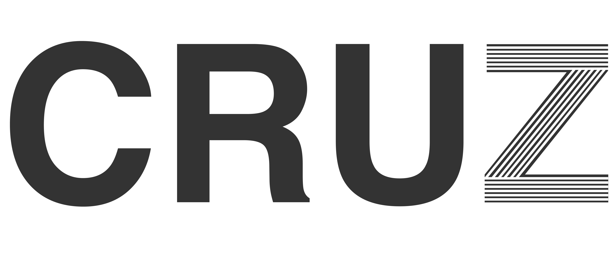

<!-- Improved compatibility of back to top link: See: https://github.com/othneildrew/Best-README-Template/pull/73 -->
<a id="readme-top"></a>
<!--
*** Thanks for checking out the Best-README-Template. If you have a suggestion
*** that would make this better, please fork the repo and create a pull request
*** or simply open an issue with the tag "enhancement".
*** Don't forget to give the project a star!
*** Thanks again! Now go create something AMAZING! :D
-->


<!-- PROJECT SHIELDS
<!--
*** I'm using markdown "reference style" links for readability.
*** Reference links are enclosed in brackets [ ] instead of parentheses ( ).
*** See the bottom of this document for the declaration of the reference variables
*** for contributors-url, forks-url, etc. This is an optional, concise syntax you may use.
*** https://www.markdownguide.org/basic-syntax/#reference-style-links

[![Contributors][contributors-shield]][contributors-url]
[![Forks][forks-shield]][forks-url]
[![Stargazers][stars-shield]][stars-url]
[![Issues][issues-shield]][issues-url]
[![project_license][license-shield]][license-url]
[![LinkedIn][linkedin-shield]][linkedin-url] -->


<!-- PROJECT LOGO -->
<br />
<div align="center">
  <a href="https://github.com/PhMoraiis/cruz">
    
  </a>

<br>
</div>


<!-- TABLE OF CONTENTS -->
<details>
  <summary>Table of Contents</summary>
  <ol>
    <li>
      <a href="#about-the-project">About The Project</a>
    </li>
    <li>
      <a href="#getting-started">Getting Started</a>
      <ul>
        <li><a href="#prerequisites">Prerequisites</a></li>
        <li><a href="#installation">Installation</a></li>
      </ul>
    </li>
    <li><a href="#contact">Contact</a></li>
  </ol>
</details>


<!-- ABOUT THE PROJECT -->
## About the Project

Cruz is a desktop application that can perform data cross-referencing from Windows AD, Bitdefender Report, DHCP and Kace Report files.

When uploading the necessary files, it formats and manipulates them to be in a format that can be used for queries.

Then it performs queries on the database and filters the data. It manipulates the tables to generate a final report that will tell you which machines have or do not have each file.

<p align="right">(<a href="#readme-top">back to top</a>)</p>

<!-- GETTING STARTED -->
## Getting Started
To get a local copy and run it, follow these simple example steps. 

### Prerequisites
---
* [Node](https://nodejs.org)

* [Git](https://git-scm.com/downloads)

* [Bun](https://bun.sh)

### Installation
---
1. Clone the repo
   ```sh
   git clone https://github.com/PhMoraiis/cruz.git
   ```
### Back-end
---
1. Change directory
    ```sh
      cd backend_app
    ```  
2. Install Bun packages
    ```sh
    bun install
    ```
3. Run the server
   ```sh
   bun dev
   ```
4. After that the server will start, the default path is http://localhost:8080 <br>
Check the path in the console where you started the application.

### Front-end
---

### Alert
If you want to install the application from the latest build, skip the Front-end configuration step.

---

1. Change directory
    ```sh
      cd .. & cd desktop_app
    ```  
2. Install Bun packages
    ```sh
    bun install
    ```
3. Run the server
   ```sh
   bun dev
   ```
4. After that the server will start, the default path is http://localhost:3000 <br>

5. If your backend starts in another path, go to the file `src/components/FormCard/index.tsx` and change the request path.
```js
await fetch(`<exchange here>/upload/${endpoint}`
```
6. If your backend starts in another path, go to the file `src/components/HomeCruz/index.tsx` and change the request path.
```js
await fetch(`<exchange here>/report/${type}?format=${format}`
```
7. `Enjoy the project!`

<p align="right">(<a href="#readme-top">back to top</a>)</p>

<!-- CONTACT -->
## Contact

Philipe Morais - contato@philipemorais.com

Project Link: [https://github.com/PhMoraiis/cruz](https://github.com/PhMoraiis/cruz)

<p align="right">(<a href="#readme-top">back to top</a>)</p>


